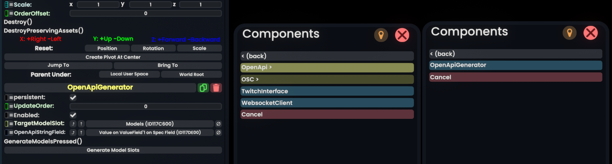

# GlooGen Usage Guide
## Installing and Running
Copy the following DLLs to your `Libraries` directory where Resonite is installed.
> **NOTE:** If you've built from source these DLLs should have already been copied to the correct directory. If `ResonitePath` was specified in `GlooGenPlugin.csproj` or exists as an environment variable at build-time, you're good to go.
- `GlooGenPlug.dll`
- `Microsoft.OpenApi.dll`
- `Microsoft.OpenApi.Readers.dll`
- `SharpYaml.dll`

Modify your Resonite launch options to load the plugin. It may be useful to make a seperate shortcut to Resonite for launching it with this plugin:
```
-LoadAssembly Libraries/GlooGenPlugin.dll
```

Your Component Browser should now include the category "Network > OpenApi". Relevant components will be listed here. Right now, there is only `OpenApiGenerator`.



When you attach the component to a slot, it will generate two additional child slots:
- **Spec Field** - Contains a `string` value field where you can paste your JSON or YAML formatted OpenApi Specification document contents for processing.
- **Models** - Slot which will be used to contain all generated models from the provided specification.

The `Models` slot is automatically assigned to the `TargetModelSlot` field in the compoent.
The `string` value field is automatically assigned to the `OpenApiStringField` field in the component.

## Generating Models
Once you've pasted your specification into the appropraite field, pressing the **Generate Model Slots** button will parse through the available schemas and attempt to create a slot for each one, parenting them under the `Models` slot or whichever slot is assigned to `TargetModelSlot`.

Each slot contains the following:
- A [Dynamic Variable Namespace](https://wiki.resonite.com/Component:DynamicVariableSpace) named after the schema as described in the specification.
- A series of [Dynamic Variables](https://wiki.resonite.com/Dynamic_Variables) that match the data type specified as closely as possible. (string, float, DateTime, etc.)
- Any data type specifed as `object` becomes a `DynamicVariableReference<Slot>` with the expectation the slot being refrenced will contain its own Dynamic Variables, serving as the object's properties.
- Any data type specified as an `array` will generate a child slot under the model, named after the property and appended with `[]`. The slot will be tagged with the array's type. If the type is an object, the the tag will be populated with the name of the model object.
- For any types that might be custom or otherwise uncertain, they will be be assigned to `string` Dynamic Variables.
